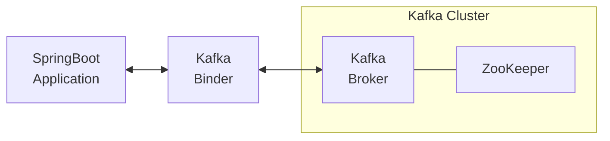
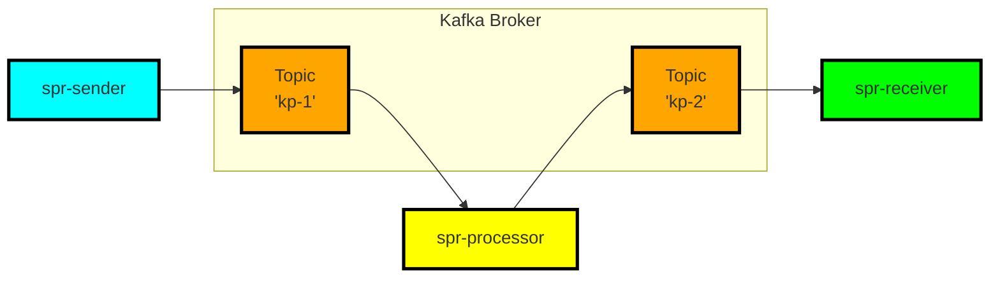

```mermaid
flowchart LR
 subgraph Kafka Cluster
  BRO[Kafka\nBroker]
  ZOO[ZooKeeper]
 end
 BIN[Kafka\nBinder]
 APP[SpringBoot\nApplication]
 
 BRO --- ZOO
 APP <--> BIN <--> BRO
```

```mermaid
flowchart LR
 subgraph Kafka Broker
  TKP1[Topic\n'kp-1']:::orangeBox
  TKP2[Topic\n'kp-2']:::orangeBox
 end
 SND[spr-sender]:::cyanBox
 PRO[spr-processor]:::yellowBox
 REC[spr-receiver]:::greenBox
 
 SND --> TKP1 --> PRO --> TKP2 --> REC
 
 classDef cyanBox    fill:#00ffff,stroke:#000,stroke-width:3px
 classDef greenBox   fill:#00ff00,stroke:#000,stroke-width:3px
 classDef orangeBox  fill:#ffa500,stroke:#000,stroke-width:3px
 classDef yellowBox  fill:#ffff00,stroke:#000,stroke-width:3px
```